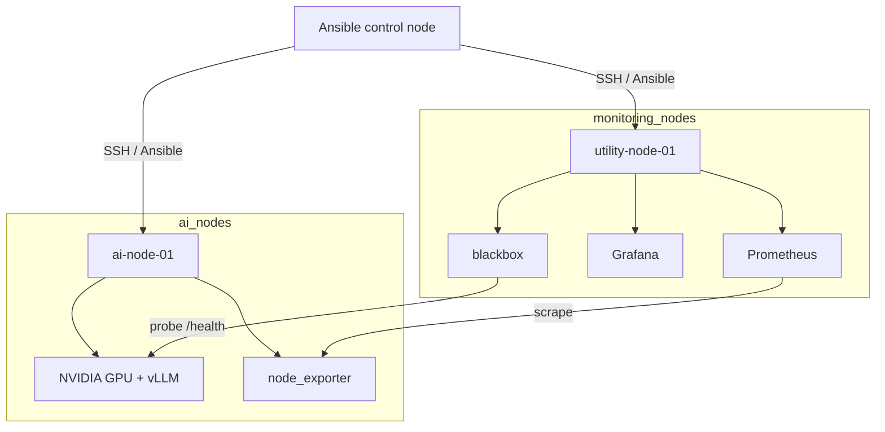

# Research AI Infrastructure Lab

Infrastructure portfolio project: automated provisioning and day-2 operations for a **small, centrally managed Rocky Linux 9** (RHEL-compatible) environment that serves an open-source LLM with **vLLM** over an OpenAI-compatible HTTP API.

This is **not** a web application. There is no React, Angular, Streamlit, or other frontend. Clients are curl, SDKs, tests, and benchmarks.

---

## Purpose

Demonstrate practical skills used in Linux server administration, infrastructure automation, GPU-backed local AI inference, and research computing environments:

- Idempotent multi-host provisioning with Ansible (`ai_nodes` + `monitoring_nodes`)
- NVIDIA GPU container workloads on inference nodes
- systemd-managed inference service lifecycle
- Centralized metrics on a utility node (Prometheus/Grafana)
- Operational scripts (health, GPU, disk, diagnose)
- Static CI plus host-side GPU integration tests
- Documented security posture for a laboratory deployment

Target reader: technical recruiter screening for Linux/AI infrastructure roles, or an infrastructure architect evaluating design choices in about five minutes.

---

## Architecture



| Group | Hosts (example) | Workload |
|-------|-----------------|----------|
| `ai_nodes` | `ai-node-01` | GPU inference (vLLM), node_exporter |
| `monitoring_nodes` | `utility-node-01` | Prometheus, Grafana, blackbox |

Design notes: [`architecture/overview.md`](architecture/overview.md) · multi-node ops: [`docs/multi-node.md`](docs/multi-node.md)

**Data path:** clients → host bind address (default localhost) → containerized vLLM → model weights / HF cache on local disk.

---

## Technologies

| Area | Stack |
|------|--------|
| OS | Rocky Linux 9 / RHEL 9-compatible |
| Automation | Ansible (roles: `common`, `users`, `security`, `container_runtime`, `nvidia`, `vllm`) |
| GPU | NVIDIA drivers (opt-in install), NVIDIA Container Toolkit |
| Containers | Podman (default) or Docker |
| Inference | vLLM, OpenAI-compatible API, configurable open-weight model |
| Languages | Python (tests, benchmark, smoke client), Bash (ops scripts) |
| Service mgmt | systemd (`vllm.service`, health timer) |
| Observability | journald; lightweight Prometheus/Grafana stack under `monitoring/` |
| Scheduling | Optional laboratory Slurm under `hpc/` (core works without it) |
| CI | GitHub Actions Static CI (no GPU) |

---

## Key capabilities

| Capability | What exists in this repo |
|------------|---------------------------|
| Centralized Linux administration | Inventory groups, shared `common`/`security`, host_vars overrides |
| Automated provisioning | `site.yml` across AI + monitoring nodes |
| GPU AI inference | Containerized vLLM; model/port/VRAM knobs via group_vars |
| Service lifecycle | Boot enablement, dependency ordering, limited `on-failure` restarts, `systemctl` / `journalctl` |
| Monitoring | Prometheus + node/DCGM/blackbox exporters + Grafana (localhost compose) |
| Health checks | `scripts/health-check.sh`, GPU/disk/service helpers, `diagnose.sh` |
| Performance benchmarking | `benchmarks/benchmark_vllm.py` against a **live** API; results only from measurement |
| Security controls | Localhost default bind, closed vLLM firewall by default, Vault pattern for HF tokens, security review doc |
| Optional HPC scheduling | Laboratory Slurm configs + example `sbatch` jobs in `hpc/` (not required by `site.yml`) |

---

## Deployment

Prerequisites: one or more Rocky Linux 9 hosts, SSH from an Ansible control node, NVIDIA stack on AI nodes per [`docs/nvidia.md`](docs/nvidia.md).

```bash
# Edit inventory: ansible/inventory/hosts.yml (+ group_vars / host_vars)

# Converge the full lab (AI + utility)
ansible-playbook -i ansible/inventory/hosts.yml ansible/playbooks/site.yml

# Or by group
ansible-playbook -i ansible/inventory/hosts.yml ansible/playbooks/site.yml --limit ai_nodes
ansible-playbook -i ansible/inventory/hosts.yml ansible/playbooks/site.yml --limit monitoring_nodes
```

After GPU + weights are ready on an AI node: set `vllm_service_started: true` (or `systemctl start vllm`), then smoke-test:

```bash
python3 scripts/test-inference.py --base-url http://127.0.0.1:8000
```

Adding a third server without rewriting roles: [`docs/multi-node.md`](docs/multi-node.md).

---

## Operations

```bash
systemctl status vllm
systemctl start vllm
systemctl stop vllm
systemctl restart vllm
journalctl -u vllm
journalctl -u vllm -f

./scripts/health-check.sh
./scripts/gpu-status.sh
./scripts/service-status.sh
./scripts/disk-status.sh
./scripts/diagnose.sh
```

Lifecycle behavior (crash, GPU missing, model load failure): [`docs/systemd-lifecycle.md`](docs/systemd-lifecycle.md).

---

## Benchmarking

Measurements are taken only against a **running** OpenAI-compatible endpoint. The repository does **not** ship fabricated latency or throughput numbers.

```bash
python3 benchmarks/benchmark_vllm.py \
  --url http://127.0.0.1:8000 \
  --requests 100 \
  --concurrency 4 \
  --max-tokens 64
```

- Writes JSON under `benchmarks/results/` with `result_type: collected_measurement`
- `benchmarks/result.example.json` and `--dry-run-schema` are **schema examples only** (placeholders, not results)

See [`benchmarks/README.md`](benchmarks/README.md).

---

## Security

Laboratory defaults:

- API bind `127.0.0.1` (not public by default)
- vLLM port closed in firewalld unless CIDRs are configured
- SSH hardening drop-in with lockout guards
- Secrets via Ansible Vault pattern; no live tokens in git
- No `--privileged` container flag; GPU device access still privileged in practice

This lab is **not** a multi-user university production deployment. Full review (threat model, remaining risks, lab vs production controls): [`docs/security.md`](docs/security.md).

---

## HPC extension

Optional **laboratory** Slurm cluster sketch (separate from core vLLM):

```text
Slurm controller
       |
       +---- compute01
       |
       +---- gpu01   (NVIDIA GPU + GRES)
```

```bash
sinfo
squeue
scontrol show nodes
sbatch hpc/jobs/gpu-test.sbatch
```

Core Ansible/`site.yml` does **not** install Slurm. Concepts, partitions, GRES, and service-vs-batch comparison: [`hpc/README.md`](hpc/README.md).

---

## Limitations

Transparent laboratory-scale boundaries:

| Limitation | Implication |
|------------|-------------|
| Small fleet (2 example hosts) | Not HA; scale by adding inventory hosts, not a cluster product |
| Lab security defaults | No API auth/TLS gateway in the default path |
| Monitoring | Compose stack under `monitoring/`; not a campus-wide observability platform |
| Slurm | Optional lab configs under `hpc/`; not a production HPC fabric; not in core playbooks |
| Drivers | NVIDIA driver install is opt-in and operator-supervised |
| Hosted CI | Static lint/unit only — no GPU on GitHub-hosted runners ([`docs/testing.md`](docs/testing.md)) |
| Model weights | Not vendored; licensing and VRAM sizing are operator responsibilities |

---

## Skills demonstrated

| Skill area | Evidence in this repo |
|------------|------------------------|
| Linux server administration | Rocky/RHEL 9 roles across AI + utility hosts: packages, users, SSH, firewalld |
| Infrastructure automation | Idempotent Ansible inventory groups, group_vars/host_vars, `site.yml` |
| Containers | Podman/Docker role, Containerfile/compose, GPU device wiring |
| NVIDIA GPU environments | Detection, toolkit install, preflight `nvidia-smi`, safe driver policy |
| AI/ML infrastructure | vLLM OpenAI-compatible serving, model/cache paths, VRAM-oriented docs |
| Research computing | Lab ops docs, optional Slurm under `hpc/`, no product UI |
| Operational troubleshooting | systemd lifecycle docs, runbooks, `diagnose.sh`, health/GPU/disk scripts |

---

## Repository map

```
architecture/   design, assumptions, decisions
ansible/        provisioning (ai-server.yml + roles)
containers/     vLLM image/compose assets
systemd/        unit reference
scripts/        health-check, gpu-status, diagnose, …
monitoring/     Prometheus, Grafana, exporters, alerts
hpc/            Optional laboratory Slurm configs + jobs
benchmarks/     live API benchmark tool
tests/          unit (CI) + integration (GPU host)
docs/           operations, security, testing, runbooks
```

---

## Documentation index

| Document | Purpose |
|----------|---------|
| [`hpc/README.md`](hpc/README.md) | Optional laboratory Slurm extension |
| [`docs/multi-node.md`](docs/multi-node.md) | Central fleet admin + adding a third server |
| [`docs/monitoring.md`](docs/monitoring.md) | Lightweight Prometheus/Grafana monitoring |
| [`docs/security.md`](docs/security.md) | Security review |
| [`docs/operations.md`](docs/operations.md) | Day-2 operations |
| [`docs/vllm.md`](docs/vllm.md) | Inference API and VRAM guidance |
| [`docs/systemd-lifecycle.md`](docs/systemd-lifecycle.md) | Service failure modes |
| [`docs/testing.md`](docs/testing.md) | Static CI vs GPU tests |
| [`docs/nvidia.md`](docs/nvidia.md) | GPU/driver flow |
| [`ansible/README.md`](ansible/README.md) | Playbook usage |

---

## License

To be decided when publishing (for example MIT or Apache-2.0). Add a `LICENSE` file at release time.
